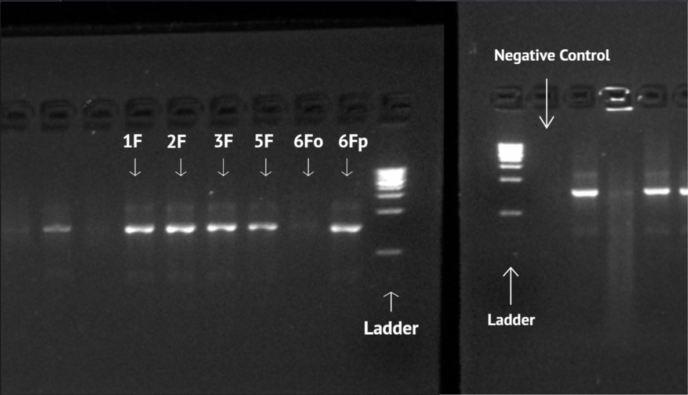
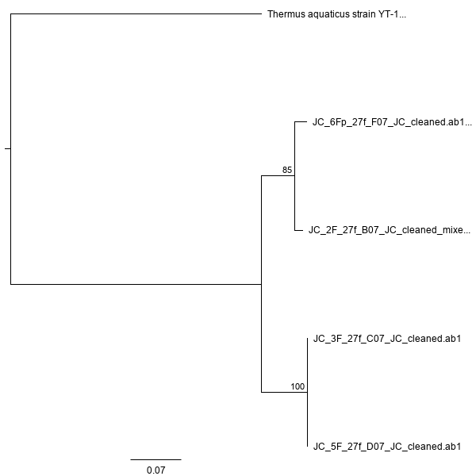
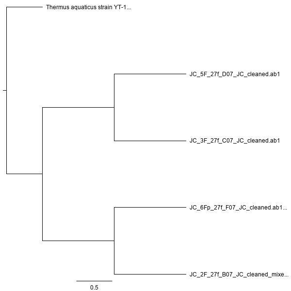

```{r setup, include = FALSE}
# load packages for analysis
knitr::opts_chunk$set(echo = FALSE, message = FALSE, warning = FALSE)
```

```{r load-libraries}
# load libraries
library("ggplot2")
library("dplyr")
library("tidyr")
library("readr")
library("broom")
library("knitr")
library("lubridate")
library("vegan")
library("dada2")
library("phyloseq")
library("seqinr")
```

```{r read-in-culture-data}
# read in the culture data from csv
culture_data <- read_csv(
  "data/raw_data/raw_culture_count_data/BIOL422_culturing_data.csv")
```

```{r read-in-culture-free-data}
# read in the culture-free data from csv
culture_free_data <- read_csv(
  "data/raw_data/raw_culture_free_count_data/BIOL422_culture_free_data.csv")
```

```{r load-in-phyloseq_obj.Rda}
# load in the phyloseq object
load("output/phyloseq_obj.Rda")
```

```{r read-in-otu-table}
# read in the otu table
otu_table <- read.table("output/sequence_variants_table.txt",
                        row.names = 1,
                        header = TRUE)

# convert the data frame to a matrix so that we can transpose it
otu_table <- as.matrix(otu_table)

# transpose the table so that samples are rows
otu_table <- t(otu_table)

# trim the row names
rownames(otu_table) <- gsub(pattern = "_.*filt",
                                        replacement = "",
                                        rownames(otu_table))
```

# Introduction

Computers have become an essential part of college life as a result of the increased dependency on the Internet. Therefore, a growing amount of students are required to buy or have access to computers. Food and drinks are constantly consumed around keyboards, which provide resources for creatures living on top of the keyboard [@malik2014study]. Keyboards are being touched constantly in personal laptops as well as shared computers open to students, faculty and staff (that the university offers). Most people are not aware of the number of microorganisms present on their keyboards [@al2011bacterial]. It is also important to emphasize human contact as it is generally the cause of microbial migration. Human beings carry different types of microbial groups depending on what each body part touches the most frequently. For example, gut and vaginal communities were discovered on toilets [@meadow2014bacterial]. The body part that comes into contact with keyboards the most are hands, which are able to access a wide variety of bacterial communities. Unlike the past, today's society spends a greater amount of time indoors in a built environment, repeatedly in contact with the same surfaces. This allows these same surfaces to accumulate a collection of different microbial organisms associated with humans. Universities are no exception as they make perfect microbial hosts with their large number of inhabitants and numerous communal keyboards [@ross2015microbial]. Not only do humans contribute to the bacteria on objects in built and natural environments, humans also increase the amount of airborne bacterial populations indoors, all possessing a possibility of horizontal gene transfer with non-airborne bacteria [@hospodsky2012human]. Since the spread and origin of a large number of bacteria are due to humans, humans should have a responsibility to uphold clean standards in order to minimize the risk of infection. 

My primary question was whether or not the keyboards of individual University of San Francisco's (USF's) college students' laptops from an upper division Bioinformatics class have more or less microbacterial species compared to shared computers on campus from the library, the University Center and Toler Hall. Previous research done on this topic has found that shared computers had more microorganisms than individual computers [@anderson2009microbial]. This project will circle around hygiene and aim to figure out if computers should be cleaned more often and if it would be necessary to raise awareness of keyboard hygiene as most people are not that informed about the number of the microorganisms present on keyboards. It is recommended that food and drink should be separated from computers and keyboards should be disinfected regularly [@hamzeh2011computer]. This is a problem, especially on a school campus where diseases spread quickly. The continuous and widespread transfer of bacteria is a dangerous process as it increases the risk of antibiotic resistance and horizontal transfer among bacteria, which is a huge issue since this hinders the progress of disease treatment [@muniesa2013could]. In the interest of preventing the spread of these microorganisms, it is important to keep regularly used computers clean, especially in shared public settings. Although the microorganisms found on computers may not be pathogenic or malignant for most people, they can definitely cause harm for people with compromised immune systems [@fraser2009bacterial]. An example of this could be burn victims, where the issue was raised if computer keyboard contamination was a possible method of transmission of methicillin-resistant *Staphylococcus aureus* onto patients [@isaacs1998swabbing]. Although *Staphylococcus epidermidis* itself is frequently found in abundance on the human skin, it also can be transferred to *Staphylococcus aureus*, which increases the pathogenic success as well as the antibiotic resistance of the latter pathogen [@otto2009staphylococcus]. Other studies found that subsets of *Staphylococcus epidermidis* secretes the serine protease Esp, which was found to inhibit *Staphylococcus aureus* colonization *in vivo* through bacterial interference [@iwase2010staphylococcus]. This could pose useful for future therapeutic developments to prevent the pathogen *Staphylococcus aureus* from infecting people. In addition, *Staphylococcus epidermidis* infections are common among patients with implanted medical devices. Preventative measures are now being taken in order to control *Staphylococcus epidermidis* through physical electrical barriers to impede bacterial colonization [@o2001staphylococcus]. This exemplifies the numerous approaches to impeding the spread of infection through stopping bacterial colonization.

Even though different institutions and people can have various methods of cleaning keyboards, without a regular and frequent keyboard cleaning, bacteria is free to grow. The longer that keyboards are not cleaned, the higher the chance that users of the keyboards will contract diseases from the microorganism or transmit the microorganism elsewhere. The microorganisms with resistances to most antibiotics or disinfectants are growing steadily and exponentially, which allows a growing amount of microorganisms to have longer lifespans on keyboards. Because of this, patients with compromised immune systems, like burn victims, no longer have the assurance of antibiotics fully curing them. Most of the bacteria that plague burn victims or other immunosuppressed patients are gram-negative bacteria, which survive significantly longer on hard surfaces (such as polyurethane, or computer keyboard covers) and humid conditions [@neely2000survey]. A longer lifespan gives microorganisms more time to transmit and spread to other places where they have more time to replicate, mutate, and increase survival chances [@eltablawy2009microbial]. Food crumbs, soda residues, and more food residues help millions of bacteria grow. Bacteria exist everywhere; as such, they must be able to adapt to a variety of environments and exhibit complicated examples of cooperative behavior [@ben1994generic]. All of the sampled keyboards were positive for microorganism growth [@eltablawy2009microbial]. The environmental surface at which bacteria grow on largely affects their survival times.

My hypothesis is that the keyboards of shared computers have more microbacterial species than individual keyboards because of the increased number of people (students, faculty, staff, etc.) that have access to the keyboard. I collected bacterial samples from three different individual laptops on the "F" key and "A" key from students from USF (University of San Francisco) and other samples from three public spaces on campus, also on the same keys. The bacteria from the "F" key samples were diluted then grown in cultures with their dilutions, where DNA was extracted from them. DNA was extracted directly from the "A" key samples. Touchdown PCR was done along with Sanger sequencing for the "F" key samples, whose results I analyzed with Geneious Prime and R Studio. Amplicon and Index PCR was done along with Illumina sequencing for the "A" key samples, whose results I analyzed with Bash. I also used a dada2 analysis pipeline to check the quality of my samples, denoise the sequences, remove chimeras, and more. 

My primary findings for the cultured data was a significant difference in the number of bacterial colonies between Communal and Individual computer keyboards. For the molecular data, it was important that the BLAST table agreed with the Maximum Likelihood Phylogeny and the Bayesian Phylogeny in which samples were more closely related. From the BLAST results in the culture-free data, I found that there was no significant difference between the number of species between Communal and Individual sample groups. From the dada2 pipeline, it was discovered that there was no significant difference in Shannon's and Simpson's alpha diversity measures between my sample groups. The Genus *Staphylococcus* from the cultured BLAST results and most of the genera from the culture-free BLAST results were matched with the genera found through the dada2 analysis pipeline.

# Methods

## Study design

I planned to look at the number of bacteria species on laptop keyboards of individual University of San Francisco students versus the bacteria found on shared computers. I sampled the "F" key and "A" key for three different individual USF students, as well as the keyboards of three different shared computers on the main campus of USF (Toler Hall, University Center, and Gleeson Library). My primary question was whether or not the keyboards of individual USF college students' laptops from an upper division Bioinformatics class have a greater variety of microbacterial species compared to shared computers on campus from the library, the UC and Toler Hall. 

For the cultured samples, I collected bacteria, diluted the samples, plated the samples on TSA plates, extracted DNA from the samples, did touchdown PCR, gel electrophoresis, and Sanger sequencing. These results were analyzed with Geneious Prime and R Studio. For the culture-free samples, I collected bacteria, extracted DNA, did PCR, gel electrophoresis, PCR again, then Illumina sequencing. These results were analyzed using Bash and R studio.

## Bacterial Collection and Dilution

The surface samples were collected during the lab section of an upper division Bioinformatics class on September 3rd, 2019. In total, twelve tubes were collected. For each location, the "F" key and the "A" key on the keyboard were swabbed. Each sterile swab was dipped in sterile PBS (Phosphate Buffer Saline at pH 7.4) to moisten, then wrung of excess PBS against the side of the tube. I swabbed each surface for 15 seconds. The tip of the swab was broken off into a labelled eppendorf with initials, date, and an unique sample ID. I gathered samples on the first floor of Toler Hall (the shared computer at the front desk), the fourth floor of the University Center (in the graphics center on a shared computer), and the first floor of Gleeson Library (on a shared computer). Subsequently, inside the Bioinformatics class, I gathered samples from three different laptops owned by three different students (Student A, Student B, and Student C) in the same way as the three previous places. The "A" key samples were placed in the freezer at -20^o^ Celsius.

## Plating "F" Key Group

A dilution series was done with the "F" key group. I put 200 µL of PBS into the six eppendorfs with swabs in order to do 1:10 dilutions and 1:100 dilutions. Since the type of bacteria was unknown nor how it would grow, it was necessary to dilute the samples in order to maximize the number of environments that the bacteria could possibly grow in. I used 18 100 mm TSA (Tryptic soy agar) plates for plating samples from each of my 2 treatments (n = 3 per group, 6 total). I put 100 µL of an eppendorf from the undiluted series onto a TSA plate and used sterile rattler Plating Beads (5 mm) to spread the medium evenly across the TSA plate. I repeated this step for the other five eppendorfs from the undiluted series, the six eppendorfs from the 1:10 dilution series, as well as six eppendorfs from the 1:100 dilution series. These 18 TSA plates were then incubated at 37^o^ Celsius for a week.

## Cultured DNA Extraction

I followed the manufacturer's protocol from the Sigma REDExtract-N-Amp kit [@weberextract]. I labelled a 1.5 mL tube for each sample and added cells from one colony to the tube using a sterile pipette tip to gently scrape off one colony (not pipetting). One colony was chosen each from the TSA plate of the undiluted sample from Toler Hall, the University Center, Gleeson library, and Student B. Two colonies were chosen from the TSA plate of the undiluted sample from Student C. During DNA extraction, the caustic extraction solution broke down cell walls and the incubation at 95^o^ Celsius was to break membranes. Dilution solution was added to stop the extraction solution from digesting DNA too. The dilution solution was added in sixteen minutes from when the extraction solution was first added, which was under twenty minute mark when the extraction solution would have started to break down the DNA as well. Qubit samples were incubated in the dark because the Qubit fluorometer, which was used to measure the concentration of DNA, is sensitive to the light. 

## Culture-Free DNA Extraction

I followed the manufacturer's protocol from the Sigma REDExtract-N-Amp kit [@weberextract]. Extraction solution and dilution solution was added directly into the tube with the swabs from the "A" key and then the swab DNA extraction methods were repeated from the cultured DNA extraction. A Qubit fluorometer was used to measure the concentration of DNA.

## Touchdown PCR for Cultured Key "F" series

For one reaction, I put 10 µL of Amp, 0.8 µL of 27f primer, 0.8 µL of 1492r primer, 1 µL BSA, and 6.4 µL of water. One µL of water was added for the negative control. PCR conditions were 95^o^ C for 5 minutes, then, 94^o^ C for 30 seconds, 65^o^ C for 30 seconds, 72^o^ C for 1 minute. These last three times were repeated for ten cycles, but the temperature was decreased by one degree per cycle. The next three temperatures and times were 94^o^ C for 30 seconds, 55^o^ C for 30 seconds, 72^o^ C 1 minute. These last three times were repeated for 25 cycles. This was done as touchdown PCR in order to achieve the best quality copies. Lastly, the PCR sample tubes were held at 72^o^ C for 10 minutes and held at 4^o^ C. The electrophoresis gel was made with 2% agarose, SYBR safe dye, 1x TAE buffer and was run at 140 V for 30 minutes. An Ez load 1 kb Molecular Ruler was added to the first and last wells of both lines of wells in the gel. After checking for successful amplification using gel electrophoresis, PCR products were cleaned with ExoSAP (Invitrogen) and sent for unidirectional Sanger sequencing at MCLAB (South San Francisco, CA) using the 27f primer. 

## PCR for Culture-Free Key "A" Series

For one reaction, I put 10 µL of Amp, 0.8 µL of 10 µL of iSeq 16S forward primer, 0.8 µL of 10 µL of iSeq 16S reverse primer, 1 µL BSA, and 6.4 µL of water. One µL of water was added for the negative control. PCR conditions were 95^o^ C for 30 seconds. Then, they were 95^o^ C for 30 seconds, 55^o^ C for 30 seconds, 72^o^ C for 30 seconds. These last three times were repeated for 25 cycles. After, they were 72^o^ C for 5 minutes then held at 4^o^ C. One µL of the sample and 199 µL of buffer were combined for the Qubit fluorometer, which was used to check if there was enough DNA concentration for the later PCRs. The electrophoresis gel was made with 2% agarose, SYBR safe dye, 1x TAE buffer and was run at 140 V for 30 minutes. An Ez load 1 kb Molecular Ruler was added to the first and last wells of both lines of wells in the gel. In this gel, 4 µL of each product, including the negative control, was added. Successful amplifications were checked using gel electrophoresis. 

Following electrophoresis, PCR products were purified using AmpureXP magnetic beads (Beckman-Coulter) and quantitated using a PicoGreen fluorescent assay (Invitrogen) on a Tecan Infinite M Plex plate reader. Purified PCR products were used as the template for a second round of PCR, which served to attach unique pairs of forward and reverse Illumina barcodes (Nextera XT Index 2 kit). All other components of the PCR mixtures were as for the first-round PCR. These reactions were cycled at 95^o^ C for 3 minutes, then 8 cycles of: 95^o^ C for 30 seconds, 55^o^ C for 30 seconds, and 72^o^ C for 30 seconds, followed by a 5 minute elongation cycle at 72^o^ C. Following this amplification, PCR products were purified and normalized with a SequelPrep normalization plate (Invitrogen), pooled, and then quantified once again with a Qubit 4 fluorometer (Invitrogen) and a TapeStation 4200 (Agilent) to verify library size and concentration. This library was then diluted to the loading concentration (50 pM) and combined with an Illumina PhiX spike-in library (5% spike in) and sequenced on an Illumina iSeq using a 2 x 150 bp consumable cartridge. Positive (ZymoBIOMICS Microbial Community DNA standard) and negative controls (sterile molecular grade reagent water) were added to the Illumina iSeq.

## Analysis

### Molecular Data Analysis

My first task was to assess whether or not the sequences were usable. I used Geneious Prime (version 2019.2.3) to trim and correct usable sequences. This was done by trimming off a large part of the beginning and ending of the sequences (since they contained either low quality or unusable bases) and going through the low quality  bases in the middle of the sequence to decide whether or not they should be deleted, changed, or an ambiguity code needed to be added from the IUPAC Ambiguity Codes. I used MAFFT [@katoh2009multiple] to create an appropriate multiple sequence alignment with all five of my usable and corrected sequences with the default settings and an offset value of 0.123. A Maximum Likelihood Phylogeny [@guindon2005phyml] and a Bayesian Phylogeny [@huelsenbeck2001mrbayes] were created using *Thermus aquaticus* (NR 025900.1) as an outgroup by downloading the sequence from GenBank. For the Maximum Likelihood Phylogeny, a substitution model of General Time Reversible (GTR) was used with 100 bootstrap replicates with defaults for all other settings. For the Bayesian Phylogeny, I used a substitution model of GTR, a rate variation of Gamma plus Invariants model, as well as a Burn-in Length of 100,000 with all other settings set to default. I used Nucleotide BLAST (Basic Local Alignment Search Tool) [@johnson2008ncbi] by comparing my nucleotide sequences to the sequence databases, where it also calculated the statistical significance of the match.

### Bash

I ran fastqc reports on the unzipped Illumina sequence files in order to check the sequence quality for each sample. Then, trimmomatic [@bolger2014trimmomatic] was run in order to trim low quality sequences or throw out bad sequences. The first five and the last five nucleotides were chopped off of each sequence. Then, looking at a sliding window of eight, sequences were checked if they matched the quality of 25 or better. If so, they were kept; if not, they were discarded. Also, if they did not have a minimum length of 140, they were once again discarded. Bioawk was used to convert fastqc files into fasta files, the format required for BLAST. I ran BLAST [@belshaw2004blastalign] against a local copy of the nt database to find the closest matched sequence for every sequence in my fasta files: 1A-6A. BLAST was also run against the same local copy of the nt database for the positive and negative controls. I also discovered the number of species per sample and what those species were.

### R Studio

I used the packages dplyr and ggplot in order to visualize the data with boxplots. I also tested between different sampling groups using Wilcox statistical tests in order to get the p values. Tidyr was used to create tidy data. Readr made reading csv files easier.

In order to generate my R-based results, a DADA analysis pipeline was used. The packages lubridate, vegan, dada2, phyloseq, and seqinr were also used. The package dada2 was used to clean and analyze the data. Phyloseq was used to visualize the data. Lubridate made it easier to work with times and dates. Seqinr was used to export a fasta of the final denoised sequence variants. 

The fastq sample names were extracted and the full path to the forward reads were specified. The quality profiles of the first 14 samples were plotted. In order to trim the sequences, a couple of steps were carried out. The command "filterAndTrim" were used to discard any sequences with N's, allow up to three expected errors, and cut off the sequences if the quality gets too low. Error models were built from each of the trimmed samples using "learnErrors", then were checked to see if they matched the data and used to denoise the sequences. Any duplicated sequences were disposed of with "derepFastq" and the remaining files were extracted and named. The dereplicated forward reads and error model were used to create a "true" list of sequences. The dada results were checked, then used to produce the "site by species matrix" [@callahan2016dada2]. A quick check ensued to look at the distribution of trimmed and denoised sequences to check they were appropriately long. The function "removeBimeraDenovo" checked for and removed chimeras, which were hybrid PCRs that contained two templates. The percentage of non-chimeric reads was calculated and a table was built showing how many sequences remained. Any sequences shorter than 50 bp were removed because taxonomy could not be assigned. Taxonomy was then assigned with "assignTaxonomy" to each sequence variant based on a supplied training set made up of known sequences. These results were then used with phyloseq [@mcmurdie2013phyloseq] to construct phyloseq object.

The otu table was read in from the saved phyloseq object so the data frame could be converted to a matrix in order to be transposed (orienting samples as rows). The package vegan was used to do a Wilcox test on Shannon and Simpson alpha diversity metrics and create a rarefaction curve. Phyloseq was used to plot alpha diversity metrics and a barplot of the taxa while dplyr and ggplot melted phyloseq object into a data frame for analysis and visualization to create summary tables of the sequence counts and abundance summary for each Phylum.

# Results

## Culture Data

The only TSA plate group of 1x, 10x, and 100x that did not have any culture growing at all was 4F, or the personal laptop from Student A, therefore no data could be drawn from it. 

There was a higher number of colonies that was present on Communal computer keyboards. The median number of colonies from the Communal samples was around 2.5 colonies larger than the median number of around 0 for Individual samples (Figure 1). There was a significant difference between the number of colony abundances between the sample groups (Table 1 Wilcox p = 0.02). Both the Communal and Individual samples had a very small range of the number of morphotypes, with an outlier of two morphotypes (Figure 2). There was no significant difference between the morphotypes between the different places I tested (Table 2 Wilcox p = 0.10). Statistical tests were performed in order to remove human subjectivity with finding statistically significant patterns. Each of the two boxplots are supported with a statistical test for a difference in group means. The easiest approach was to use a Wilcox test (a nonparametric alternative to the t-test).

### Colony Abundance 

The colony abundances from the Communal computers had larger number of colonies compared to the Individual computers, which is shown by the maximum number of colonies observed in the Individual computers remaining smaller than the minimum of the colony abundances from the Communal computers (Figure 1). I also observed a bigger range of larger values for the colony abundances of Communal computers where the minimum and maximum number of colony abundances had a difference of around eight, whereas the differences between the minimum and maximum number of colony abundances for Individual computers was about one. The colony abundance for Individual computers had a singular abnormally abundant colony depicted by the outlier, just under the 2.5 number of colonies mark. A statistical (Wilcox) test was run to compare the number of colony abundances of Communal versus Individual computers at 1x dilution. The mean number of colonies between Communal and Individual computers were significantly different (Table 1 Wilcox p = 0.02).

### Morphotypes

I made a boxplot showing the number of morphotypes in Communal versus Individual computer keyboards for 1x dilution (Figure 2). Both Communal and Individual computer keyboards had an outlier of two morphotypes. The Communal computer keyboards had a median, minimum, and maximum of one morphotype. Individual computer keyboards had a median and minimum of 0 morphotypes and a maximum of 0.75 morphotypes. The mean number of morphotypes between Communal and Individual computer keyboards were not significantly different (Table 2 Wilcox p = 0.1). This was the result of a statistical test to compare the number of morphotypes in Communal versus Individual computer keyboards. 

### Grown Cultures

Two colonies were used from 6F (Figure 3). 3F and 5F both had a single colony growing significantly larger than other colonies. 6F had two different morphotypes, while every other culture had the same morphotype: circular with pale coloring. 2F had many small culture growing. 

## Molecular Data

### Qubit DNA extraction

The measured Qubit numbers of the DNA extractions from the "F" key culture samples had a sufficient concentration of DNA in order to ensure that I had enough DNA to amplify in PCR, a later step. All of my samples showed that they had a sufficient amount of DNA from the Qubit numbers, which were all above 5 ng/µL (Table 3).

### Gel Electrophoresis

Bright bands, or higher concentrations, were shown for the 1F, 2F, 3F, 5F, and 6Fp samples, while the 6Fo sample showed a faint band, or a lower concentration (Figure 4). The bands all showed up at a similar place,  using to the ladder. There were no bands at all in the negative control.

### Sequence Usability Table

The original filename of my sequences came from the Sanger sequencing. There were only five out of the seven sequences that were usable. The number of bases after the sequences were trimmed as well as the number of bases corrected is in Figure 4.

### BLAST Table

The high 100% Query Covers for 1F, 2F, 3F, 5F, and 6Fp sequences meant a large percentage of the target sequence covered the query sequence (Table 5). The 5F trimmed sequence had a percent identity of over 98%, showing that the matched BLAST sequence was very similar to my trimmed sequences (Table 5). My trimmed sequence of 1F, 2F, 3F, and 6Fp had a percent identity over 99%, which means the matched BLAST sequences were even more similar. The accession number is an unique tag for a sequence that allows me to track different versions of the sequence over time. The E-value (expect value) was 0.0 for all of my usable sequences, therefore I am confident that the matched BLAST sequences were not due to chance (Table 5). 

### Maximum Likelihood Phylogeny with PhyML

I found that sequences 6Fp and 2F are grouped together in a monophyletic clade with 85 bootstrap support value, while sequences 3F and 5F are grouped together in a monophyletic clade with 100 bootstrap support (Figure 5). This was also supported by the Bayesian Phylogeny (Figure 6).

### Bayesian Phylogeny with Mr. Bayes

For the Bayesian Phylogeny, *Thermus aquaticus* was used as the outgroup. I found that sequences 6Fp and 2F are grouped together in a monophyletic clade, while sequences 3F and 5F are grouped together in a monophyletic clade (Figure 6). This was also supported with the Maximum Likelihood Phylogeny (Figure 5; ML bootstrap > 80).

## Culture Free Molecular Data

### Qubit DNA extraction

The measured Qubit numbers of the DNA extractions from the "A" key culture samples had sufficient concentrations of DNA in order to ensure that I had enough DNA to amplify in PCR, a later step. All of my samples showed that they had a sufficient amount of DNA from the Qubit numbers, which were all above 5 ng/µL (Table 6).

### Qubit Right Before Gel Electrophoresis

The measured Qubit numbers of the "A" key samples right before gel electrophoresis had sufficient concentrations of DNA in order to ensure I had enough DNA to amplify in another PCR step (Table 7).

### Trimmed Sequences

Based on the fastqc reports, the sequence quality of my samples were very good as none of my sequences were flagged as poor quality (all quality scores of over 30, meaning a 1 in 1000 chance of an incorrect base decision), which meant that they did not require much trimming. All of the unusable nucleotides were trimmed with Trimmomatic, leaving the entirety of my samples surviving with over 92% of the sequence intact (Table 8).

### Number of Species per Sample

I made a boxplot showing the number of different species in Communal versus Individual computer keyboards (Figure 7). Both Communal and Individual computer keyboards had no outliers. The mean number of different species between Communal and Individual computer keyboards were not significantly different (Table 8 Wilcox p = 0.7). This was the result of a statistical test to compare the number of different species in Communal versus Individual computer keyboards. 

### Finding BLAST species from Cultured Data in Culture-Free Data

I discovered that the majority of the Cultured BLAST species were found in the Culture-Free BLAST results (Table 10). *Staphylococcus hominis* was the only species that was not found in the Culture-Free BLAST results for Sample 2A (Table 10). Since no culture was grown for Sample 4F, there was nothing to compare with the Culture-Free BLAST results (Table 10).

### BLAST Table for Control Samples

It was found that the most abundant and the second most abundant species found for the positive controls were all the same: *Salmonella enterica* subsp. *enterica serovar Indiana* and *Listeria monocytogenes* (Table 11). The negative controls obtained a variety of the second most abundant species (Table 11). I also searched for *Escherichia coli* and *Haemophilus parainfluenzae*, which were found in the negative controls, in my samples 1A-6A. However, they were not present in samples 1A-6A.

## Culture-Free R program Analyses

In the dada2 analysis pipeline, the sample qualities were calculated, sequences were trimmed, chimeras were removed, and more. The pipeline plotted the quality profiles of the first 14 samples. The qualities of all of my samples were very high, meaning all were good quality. The highest of number of bases that were trimmed and denoised off of all of my sequences, including the controls, was 40 base pairs out of thousands of base pairs (Table 12). No samples were removed for low quality. This makes sense as my samples had very high quality scores. Out of 637 input sequences, 79 PCR chimeras were identified and removed. A good percentage, 90.36%, of our reads survived and were therefore non-chimeric, leading to the total Amplicon Sequence Variants (Table 12). 

A rarefaction curve is the relationship between the sample size and the discovery of new species in the sequences. I feel confident that I completely sampled the communities in the samples and the controls because all of the curves asymptoted (Figure 8). All of my samples had over 9,000 base pairs, which was well over where the curves asymptoted (Figure 8).

### Using Phyloseq-native Analyses

```{r Wilcox-test-using-shannon-diversity, results = "hide"}
# shannon diversity numbers for each of the samples
shannon_div <- diversity(otu_table, index = "shannon")

# vector one: filter out JC samples
jc_shannon_div <- shannon_div[grepl(pattern = "JC", names(shannon_div))]

# vector two: create JC sample groups
jc_group <- c(rep("Communal", 3), rep("Individual", 3))

# combine vectors
combined_shannon <- cbind(jc_group, as.numeric(jc_shannon_div))

# wilcox p = 0.7
wilcox_shannon <- wilcox.test(data = combined_shannon,
            jc_shannon_div ~ jc_group)
```

```{r Wilcox-test-using-simpson-diversity, results = "hide"}
# simpson diversity numbers for each of the samples
simpson_div <- diversity(otu_table, index = "simpson")

# vector one: filter out JC samples
jc_simpson_div <- simpson_div[grepl(pattern = "JC", names(simpson_div))]

# vector two: create JC sample groups
jc_group_2 <- c(rep("Communal", 3), rep("Individual", 3))

# combine vectors
combined_simpson <- cbind(jc_group_2, as.numeric(jc_simpson_div))

# wilcox p = 0.7
wilcox_simpson <- wilcox.test(data = combined_simpson,
            jc_simpson_div ~ jc_group_2)
```

As a popular means to quantify composition, Shannon's index (which highlights the richness component of diversity) and Simpson's index (emphasizing the evenness component) work together to depict the response variation to changes in richness and evenness [@nagendra2002opposite]. In both Shannon's and Simpson's diversity values, the median alpha diversity measure for the samples were greater than the medians of the controls, meaning that my samples had greater richness and evenness in comparison to the positive and negative controls (Figure 9). The alpha diversity measures were not significantly different between sample groups for Shannon and Simpson (Wilcox p = `r wilcox_simpson$p.value`; Wilcox p = `r wilcox_simpson$p.value`).

Many of the phylum were unknown, especially in the Communal samples (Figure 10). The majority of the phylum found in my samples were *Actinobacteria*, *Firmicutes*, and *Proteobacteria* (Figure 10). These three phyla were also found in the negative controls, which was very surprising (Figure 10). The positive controls contained no unknown phylum, which was expected (Figure 10). 

### Using dplyr and ggplot Analyses

The top five abundance values for my samples make it clear that the majority of genera are unknown (Figure 11). The top five genera that were found in my samples were NA, *Propionibacterium*, *Streptococcus*, *Staphylococcus*, and *Pseudomonas* in that order (most to least), which is similar to the genera *Staphylococcus* and *Bacillus* found in the cultured BLAST data (Figure 11; Table 5).

Filtering out only my samples using dplyr and ggplot, the three most abundant phyla outside of the unknown were *Actinobacteria*, *Firmicutes*, and *Proteobacteria*, which agrees with Figure 10, which used phyloseq to analyze the data (Figure 12). This gives me confidence that those three phyla were the most prominent in my samples.

Looking at the three most prominent phyla sorted by sample group: there was a greater mean abundance of *Actinobacteria* and *Proteobacteria* in the Communal samples while in the Individual samples, there were more *Firmicutes* (Figure 13). The error bars show that the samples had a lot of variance, which means that my samples had a range of results and the apparent difference between the sample groups may not be significant (Figure 13).

There was a greater sum abundance of *Actinobacteria* and *Proteobacteria* in the Communal samples while in the individual samples, there was more *Firmicutes* in the three most prominent phyla sorted by sample group (Figure 14). Since the distribution of the sum abundances and the mean abundances were similar, it proves that there were only small differences between sample sequences. That also means that my data does not include any extreme outliers, which is favorable.

# Discussion

My primary question was whether or not the keyboards of Individual USF college students' laptops from an upper division Bioinformatics class have more or less microbacterial species compared to Shared computers on campus from the Toler Hall, the UC, and Gleeson library. I hypothesized that the keyboards of shared computers have more microbacterial species than individual keyboards because of the increased number of people (students, faculty, staff, etc.) that have access to the keyboard. My primary findings for the cultured data was a significant difference in the number of colonies between Communal and Individual computer keyboards. For the molecular data, it was important that the BLAST table agreed with the Maximum Likelihood Phylogeny and the Bayesian Phylogeny in which samples were more closely related. From the culture-free data, I found that there was no significant difference between the number of species between Communal and Individual sample groups. From the dada2 pipeline, it was discovered that there was no significant difference in Shannon's and Simpson's alpha diversity measures between my sample groups. The Genus *Staphylococcus* from the cultured BLAST results and most of the genera from the culture-free BLAST results were matched with the genera found through the dada2 analysis pipeline.

## Grown Cultures

I found that the 1x dilution cultures worked the best because all of the Communal computer samples had at least one colony and a majority of the Individual computer keyboard samples had at least one colony.

The only TSA plate group of 1x, 10x, and 100x that did not have any cultures growing at all was 4F, or the personal laptop from Student A. This was similar to previous research since a majority of the samples contained bacterial contamination and for my small sample size of six different bacterial swabs, five out of six showing bacterial contamination is congruent with previous findings since a majority of samples contained bacterial contamination [@al2011bacterial]. Two colonies were chosen from the TSA plate of the undiluted sample from Student C, or sample 6F, for this reason (Figure 3). 

## Touchdown PCR for "F" key series

The PCR strip tubes were put in the machine for 95^o^ C for 5 minutes. Then, they were put in the machine for 94^o^ C for 30 seconds, 65^o^ C for 30 seconds, and 72^o^ C for 1 minute. These last three cycles were repeated for ten additional cycles, where the temperature was decreased by one degree per cycle. Touchdown PCR was used in order to increase selectivity so that higher quality attractions would click together in the beginning [@korbie2008touchdown]. The purpose of starting at a higher temperature was to be more selective at the first round of 65^o^ C with the copies of the best match. As the temperature decreased by one degree, it created matches and copies preferentially of the already selective primer rather than the original strand. Also, if I had accidentally put two colonies instead of one, one colony would most likely be a better match to the primer, then the primer would preferentially amplify that one.

## PCR for Key "A" Series

The PCR for the culture-free samples was not touchdown PCR and was only half the time of the PCR for the cultured samples. There was no need to be selective since all of the sequences had the same primer.

## Gel Electrophoresis

For the gel electrophoresis, buffer was used instead of water because nothing would happen with water while buffer is able to conduct a high level of current. Agarose gel was used rather than polyacrylamide because agarose is less dense and gives DNA more space to stretch out. The master mix contained glycerol, which made my sample more dense than water, causing it to sink at the bottom of the well in the gel instead of mixing with water in the gel.  There were ladders in the first and last wells of each of the two lines of wells in order for them to act as standards (a bunch of fragments of DNA at known lengths). The ladders act as the positive control from the cyber working. If the electrophoresis and the cyber works, then the known lengths of DNA fragments should be seen. The ladder looks more grouped together above 3 kb because the gel only ran for 30 minutes. There were bright bands shown for 1F, 2F, 3F, 5F, and 6Fp at 1-2 kb, a faint band for 6Fo at 1-2 kb, and no band for the negative control (Figure 4). There were no bands for the negative control because there is no DNA in there, which was what I would expect to see. There was a strange brightness above the bright band possibly because tandem repeats of the ribosome were made due to their importance. In order to fix this problem in future projects, I could change the restriction enzyme, drop the number of cycles (however faint bands would most likely not show at all), or shorten the extension time (to give taq polymerase less time to copy). The fluorescence around 30 kb was due to the gel having auto-fluorescence and was not due to the DNA.

## Geneious Prime

The sequence 6Fo was not usable possibly either because there the DNA was low quality, an incorrect amount of DNA template was used, mixed templates were sequenced, there was not enough DNA, or I used the wrong the primer (Figure 4). For future follow-up experiments, I could use an agarose gel to check the DNA template concentration prior to sequencing or to make my own primer. Knowing that I was sequencing bacteria, some of the ambiguous peaks I observed in the 1F and 2F trimmed sequences were probably because I might have sampled two colonies instead of one (Table 4). Another reason why this may have occurred was because the colony sampled is an entire population, which consists of millions of cells that have divided and might have had mutations. I had over 400 bases for a majority of my sequences after trimming, and five usable sequence (Table 4). This was an acceptable amount of bases to be used for the alignments and phylogenies. All of my usable sequences were mostly high quality 16S sequences that required less than eight bases that needed to be manually corrected (Table 4). 

## Sequence Relationships

The matched BLAST sequences were matched with *Staphylococcus epidermidis*, 2F was *Staphylococcus hominis*, 3F and 5F were *Bacillus subtilis*, and 6Fp was *Staphylococcus epidermidis* (Table 5). This was similar to previously identified bacteria in preceding research set up in the same university conditions [@anderson2009microbial]. The trimmed sequence of 1F was not included in the phylogenies because it was too low quality for an accurate phylogeny. The phylogenetic results using the trimmed sequences of 2F, 3F, 5F, and 6Fp matched with my BLAST results. In both phylogenies, *Thermus aquaticus* was used as the outgroup, from the domain Archaea. Since the bacteria I cultured were unknown, I needed to use the domain Archaea as the outgroup, which had the closest relation to the domain Bacteria. In the Maximum Likelihood Phylogeny, sequences 6Fp and 2F were grouped together in a monophyletic clade with a 85 bootstrap support value, while sequences 3F and 5F were grouped together in another monophyletic clade with a 100 bootstrap support value, which agreed with the separation of genera *Staphylococcus* and *Bacillus* from the BLAST table (Figure 5; Table 5). The Bayesian Phylogeny agreed with the Maximum Likelihood Phylogeny and the BLAST table, resulting with the same groupings (Figure 6). 

I expected the Sanger-sequenced cultured BLAST species to be found in the Illumina-sequenced culture-free BLAST species because Illumina sequencing amplifies everything while Sanger sequencing only amplifies one cultured colony. However, that was not the case (Table 10). Some reasons as to why this happened could be because I sampled the "F" key for Sanger sequencing and the "A" key for Illumina sequencing, which are not correlated with each other besides being located on the left side of the keyboard. For future follow-up experiments, I could either sample two keys that are both vowels, all which are heavily used, or the "F" and "J" keys, which are both finger placeholders. 

The only the Genus *Staphylococcus* in the cultured BLAST data were found in the top five genera that were found in my samples from using the dada2 analysis pipeline: NA, *Propionibacterium*, *Streptococcus*, *Staphylococcus*, and *Pseudomonas* in that order, most to least (Figure 11; Table 5). In the culture-free BLAST data, the most top BLAST matches were uncultured organism, *Bacillus* sp., uncultured *Staphylococcus* sp., *Streptococcus salivarius*, and *Pseudomonas protegens*, which matched the matched genera in the dada2 analysis pipeline better. This could be due to the fact that the cultured BLAST had the least amount of data to match to BLAST. The genus *Propionibacterium* is mainly associated with acne development [@bojar2004acne]. In the recent past, antibiotics against acne caused by this genus have become less effective with the increasing amount of strains that are becoming resistant. *Propionibacterium* are also found commonly on normal human skin. For future experiments, it would be interesting to test the keyboards of different age groups to see if *Propionibacterium* would remain as the most found Genus as younger age groups have more cases of acne as a result of unhealthy food choices [@wolf2004acne]. The reason why *Bacillus* was found in the cultured data but not included in the most abundant genera was because I picked random colonies to culture and BLAST (Table 5; Figure 11).

A majority of my samples had a greater number of surviving sequences after going through Trimmomatic as opposed to the dada2 analysis pipeline (Table 8; Table 12). I expected the samples in the dada2 analysis pipeline to have a smaller number of unique sequences because the samples in the dada2 analysis pipeline got rid of any duplicated sequences and chimeras. However, 1A and 4A had less unique sequences going through Trimmomatic compared to the non-chimeric unique sequences that survived (Table 8; Table 12). A reason for this could be because of the different quality cutoffs between the two approaches. 

Another odd circumstance that occurred was that the negative controls contained bacteria such as *E. coli* and *Haemophilus parainfluenzae*, which are contaminants and unexpected in supposedly sterile molecular grade reagent water. Since there the negative control produced a positive result, a confounding variable was involved. However, neither *E. coli* or *Haemophilus parainfluenzae* were found in the BLAST samples of my sequences. Illumina sequencing and BLAST of the positive controls worked because the positive controls contained the expected bacteria (Table 10). In addition, the alpha diversity metrics numbers of the negative controls were supposed to be zero, however that result was not attained (Figure 9). The majority of the phyla found in my samples were *Actinobacteria*, *Firmicutes*, and *Proteobacteria* (Figure 10). On the skin, it is normal to find such a large amount *Actinobacteria*, *Firmicutes*, and *Proteobacteria* on the human body which explains why so much of it was found on keyboards ([@fredborg2012g]). The samples had a lot of variance, which means that my samples had a range of results and the apparent difference between the sample groups may not be significant (Figure 13). These three phyla were also found in the negative controls, which was very surprising since it was supposed to be sterile molecular grade reagent water (Figure 10). A possible reason why the negative controls may have contained these contaminants was because the indexes during the last PCR may have been contaminated. For a future experiment, the exact same experiment could be repeated to ensure that was the reason why such odd results were observed in the negative controls.

### Big Picture

Both the cultured data and the culture-free data did not support my hypothesis. There were many bacteria found on the keyboards of both sample groups. However, among these bacteria, there was little diversity. From the cultured data, I discovered that many samples across Communal and Individual keyboards shared genera. Sequences 6Fp and 2F were from the genus *Staphylococcus*, yet 6Fp was from an Individual Student's computer keyboard while 2F was from a shared computer keyboard (Table 5, Figure 5, Figure 6). Sequences 3F and 5F were from the genus *Bacillus*, yet 3F was from a shared computer keyboard while 5F was from an Individual Student's computer keyboard (Table 5, Figure 5, Figure 6). Furthermore, from the culture-free data, I found that there was no significant difference between the number of species between Communal and Individual sample groups (Table 8 Wilcox p = 0.7). The mean numbers of the alpha diversity measures were also not significantly different between sample groups using Shannon and Simpson (Wilcox p = 0.7; Wilcox p = 0.7). I did, however, find that there was a significant difference in colony abundance on communal keyboards over individual keyboards (Table 1 Wilcox p = 0.02). This indicates that there were more living bacteria on Communal compared to Individual keyboards that were able to grow in the culturing conditions that were set in this experiment. In future experiments, it would be interesting to grow the bacteria in different conditions to see if there remains a significant difference in colony abundance between sample groups.

Computers, and therefore their keyboards, continue to advance with time as our society's dependency upon the Internet increases. As of now, computers and individual laptops are very commonplace within a university setting. Food is constantly being consumed around keyboards, providing resources for the bacteria on keyboards [@malik2014study]. This may explain why I found significantly more colonies of bacteria from the Communal sample group since more people have access to shared computers. Human hands come into contact with the keyboard, which makes sense why most of the bacteria I found from the samples were normally found on skin. Although the microorganisms found on computers may not be pathogenic or malignant (mainly bacteria normally found on skin such as bacteria that cause acne) for most people, they may harm people with compromised immune systems [@fraser2009bacterial]. As such, even though I did not find a significant difference between the number of species between Communal and Individual sample groups, humans still have the responsibility to uphold good hygiene and clean their keyboards on a regular basis.

# Figures and Tables

```{r filter-and-plot-abundances}
# filter out only my 1x dilutions and make a boxplot
culture_data %>%
  filter(student_name == "Jacinda Chen") %>%
  filter(dilution_1_10_or_100 == "1") %>%
  ggplot(aes(x = sample_group, y = number_of_colonies)) +
  geom_boxplot() +
  ggtitle(
    "Comparison of Colony Abundances \nBetween Sample Groups"
    , "1x dilution") +
  xlab("Sample Group") +
  ylab("Number of Colonies")
```

**Figure 1:** Boxplot of colony abundances at Communal versus Individual computers, 1x dilution. There was a higher median number of colonies from Communal Computer samples, and the mean number of colonies were significantly different between the two sites (Wilcox p = 0.02104).

```{r abundances-stats}
# run a statistical test to compare the two groups of abundances
culture_data %>%
  filter(student_name == "Jacinda Chen") %>%
  filter(dilution_1_10_or_100 == "1") %>%
  wilcox.test(data = .,
              number_of_colonies ~ sample_group) %>%
  broom::glance(x = .) %>%
  knitr::kable()
```

**Table 1:** The statistical (Wilcox) test to compare the number of colony abundances between Communal and Individual computer keyboards, 1x dilution.

```{r filter-and-plot-morphotypes}
# Comparison of morphotypes between Communal and Individual computer keyboards
culture_data %>%
  filter(student_name == "Jacinda Chen") %>%
  filter(dilution_1_10_or_100 == "1") %>%
  ggplot(aes(x = sample_group, y = as.numeric(number_of_morphotypes))) +
  geom_boxplot() +
  ggtitle(
    "Comparison of Morphotypes In Communal \nand Individual Computer Keyboards"
    , "1x dilution") +
  xlab("Sample Group") +
  ylab("Number of Morphotypes")
```

**Figure 2:** Boxplot showing the number of morphotypes between Communal and Individual computer keyboards, 1x dilution. The mean number of morphotypes were not significantly different between sample groups (Wilcox p = 0.09679).

```{r morphotype_stats}
# run a statistical test to compare number of morphotypes between two groups
culture_data %>%
  filter(student_name == "Jacinda Chen") %>%
  filter(dilution_1_10_or_100 == "1") %>%
  wilcox.test(data = .,
              as.numeric(number_of_morphotypes) ~ sample_group) %>%
  broom::glance(x = .) %>%
  knitr::kable()
```

**Table 2:** The statistical (Wilcox) test to compare the number of morphotypes between Communal and Individual computer keyboards, 1x dilution.


**Figure 3:** A picture showing the usable colonies from culturing with 1F, 2F, 3F, 5F, and 6F sample TSA plates.

| Sample | Qubit Number Range (ng/µL) |
|--------|----------------------------|
| 1F     | 5.40                       |
| 2F     | 6.10                       |
| 3F     | 8.76                       |
| 5F     | 7.51                       |
| 6Fo    | 5.66                       |
| 6Fp    | 9.05                       |

**Table 3:** Table of Qubit DNA extraction samples of Key "F" series (cultured).



**Figure 4:** Gel electrophoresis image of samples 1F, 2F, 3F, 5F, 6Fo, 6Fp, ladder, and negative control. 

| Sequence Locus | Original Sequence Filename | Corrected Sequence Filename        | Usability | Length after trimming | Manually corrected/adjusted bases |
|----------------|----------------------------|------------------------------------|-----------|-----------------------|-----------------------------------|
| 16S            | JC_1F_27f_A07.ab1          | JC_1F_27f_A07_JC_cleaned_mixed.ab1 | Usable    | 426 bases             | 4                                 |
| 16S            | JC_2F_27f_B07.ab1          | JC_2F_27f_B07_JC_cleaned_mixed.ab1 | Usable    | 658 bases             | 4                                 |
| 16S            | JC_3F_27f_C07.ab1          | JC_3F_27f_C07_JC_cleaned.ab1       | Usable    | 634 bases             | 3                                 |
| 16S            | JC_5F_27f_D07.ab1          | JC_5F_27f_D07_JC_cleaned.ab1       | Usable    | 593 bases             | 7                                 |
| 16S            | JC_6Fo_27f_E07.ab1         | JC_6Fo_27f_E07_JC_failed.ab1       | Unusable  | N/A                   | N/A                               |
| 16S            | JC_6Fp_27f_F07.ab1         | JC_6Fp_27f_F07_JC_cleaned.ab1      | Usable    | 559 bases             | 3                                  |
| 16S            | JC_Neg_27f_G07.ab1         | JC_Neg_27f_G07_JC_failed.ab1       | Unusable  | N/A                   | N/A                               |

**Table 4:** Table depicting the original filenames, usable trimmed sequences that were corrected and renamed, and details surrounding the latter.

| BLAST filenames                    | Description                                                                                         | Percent Identity | Query cover | Accession  | E-Value |
|------------------------------------|-----------------------------------------------------------------------------------------------------|------------------|-------------|------------|---------|
| JC_1F_27f_A07_JC_cleaned_mixed.ab1 | *Staphylococcus epidermidis* strain IBK-11 16S ribosomal RNA gene, partial sequence                   | 99.53%           | 100%        | MN428237.1 | 0.0     |
| JC_2F_27f_B07_JC_cleaned_mixed.ab1 | *Staphylococcus hominis* subsp. novobiosepticus strain IBK-7 16S ribosomal RNA gene, partial sequence | 99.39%           | 100%        | MN428234.1 | 0.0     |
| JC_3F_27f_C07_JC_cleaned.ab1       | *Bacillus subtilis* strain SR3-30 16S ribosomal RNA gene, partial sequence                            | 99.53%           | 100%        | MN421487.1 | 0.0     |
| JC_5F_27f_D07_JC_cleaned.ab1       | *Bacillus subtilis* strain SR3-30 16S ribosomal RNA gene, partial sequence                            | 98.82%           | 100%        | MN421487.1 | 0.0     |
| JC_6Fp_27f_F07_JC_cleaned.ab1      | *Staphylococcus epidermidis* strain LY-2 16S ribosomal RNA gene, partial sequence                     | 99.82%           | 100%        | MH930441.1 | 0.0     |

**Table 5:** Table of nucleotide BLAST results of edited sequences.



**Figure 5:** Maximum Likelihood Phylogeny with PhyML using *Thermus aquaticus* as an outgroup.



**Figure 6:** Bayesian Phylogeny with Mr. Bayes using *Thermus aquaticus* as an outgroup.

| Sample | Qubit Number Range (ng/µL) |
|--------|----------------------------|
| 1A     | 5.37                       |
| 2A     | 6.73                       |
| 3A     | 5.95                       |
| 4A     | 6.50                       |
| 5A     | 5.50                       |
| 6A     | 5.96                       |

**Table 6:** Table of Qubit DNA extraction samples of Key "A" series (culture-free).

| Sample       | Qubit Number Range (ng/µL) |
|--------------|----------------------------|
| 1A           | 4.00                       |
| 2A           | 4.56                       |
| 3A           | 4.54                       |
| 4A           | 4.74                       |
| 5A           | 4.58                       |
| 6A           | 4.14                       |
| Neg. Control | 3.62                       |

**Table 7:** Table of Qubit samples of Key "A" series (culture-free) right before gel electrophoresis.

| Sample | Surviving % | Survived | Dropped% |
|--------|-------------|----------|----------|
| 1A     | 95.16%      | 13971    | 4.84%    |
| 2A     | 95.54%      | 12796    | 4.46%    |
| 3A     | 95.43%      | 14715    | 4.57%    |
| 4A     | 92.90%      | 9158     | 7.10%    |
| 5A     | 95.58%      | 13710    | 4.42%    |
| 6A     | 95.01%      | 10769    | 4.99%    |

**Table 8:** Table of the percentage of surviving and dropped sequences for all six samples after trimming.

```{r plot-number-of-species}
# make a boxplot of the number of species per sample
culture_free_data %>%
  ggplot(aes(x = sample_group, y = number_of_species)) +
  geom_boxplot() +
  ggtitle(
    "Comparison of the Number of \nDifferent Species Between Sample Groups") +
  xlab("Sample Group") +
  ylab("Species Count")
```

**Figure 7:** Boxplot showing the number of different species between Communal and Individual samples. The mean number of different species were not significantly different between sample groups (Table 9 Wilcox p = 0.7).

```{r species_count_stats}
# run a statistical test to compare the two groups of species numbers
culture_free_data %>%
  wilcox.test(data = .,
              number_of_species ~ sample_group) %>%
  broom::glance(x = .) %>%
  knitr::kable()
```

**Table 9:** The statistical (Wilcox) test to compare the number of different species between Communal and Individual computer keyboards.

| Sample | Cultured BLAST             | Culture-Free BLAST |
|--------|----------------------------|--------------------|
| 1A     | *Staphylococcus epidermidis* | Found              |
| 2A     | *Staphylococcus hominis*     | Not Found          |
| 3A     | *Bacillus subtilis*          | Found              |
| 4A     | N/A                          | N/A                |
| 5A     | *Bacillus subtilis*          | Found              |
| 6A     | *Staphylococcus epidermidis* | Found              |

**Table 10:** Table matching the species in the Cultured BLAST to the Culture-Free BLAST data.

| Sample Groups            | Most Abundant Species                               | Second Most Abundant Species |
|--------------------------|-----------------------------------------------------|------------------------------|
| Positive Control (zymo1) | *Salmonella enterica* subsp. *enterica serovar Indiana* | *Listeria monocytogenes*       |
| Positive Control (zymo2) | *Salmonella enterica* subsp. *enterica serovar Indiana* | *Listeria monocytogenes*       |
| Positive Control (zymo3) | *Salmonella enterica* subsp. *enterica serovar Indiana* | *Listeria monocytogenes*       |
| Positive Control (zymo4) | *Salmonella enterica* subsp. *enterica serovar Indiana* | *Listeria monocytogenes*       |
| Negative Control 1       | *Acinetobacter tandoii*                               | *Escherichia coli*             |
| Negative Control 2       | *Acinetobacter tandoii*                               | *Micrococcus* sp.              |
| Negative Control 3       | *Acinetobacter tandoii*                               | *Escherichia coli*             |
| Negative Control 4       | *Acinetobacter tandoii*                               | *Haemophilus parainfluenzae*   |

**Table 11:** BLAST Table of the most abundant and second-most abundant species in the positive (from ZymoBIOMICS Microbial Community DNA standard) and negative controls (sterile molecular grade reagent water).

```{r make-a-rarefaction-curve}
# Rarefaction curve between samples: asking as sample size increases
# if additional new species are still found
rarecurve(otu_table,
          main = "Rarefaction Curve Between Samples and Controls")
```

**Figure 8:** Rarefaction curve of samples (1A-6A) and controls.

```{r shannon-and-simpson-diversity-figure}
# Using phyloseq-native anlayses to do alpha diversity metrics
plot_richness(phyloseq_obj,
              x = "type",
              measures = c("Shannon", "Simpson")) +
  xlab("Type of sample") +
  geom_boxplot() +
  theme_bw() +
  ggtitle("Diversity of Samples")
```

**Figure 9:** Boxplot of Shannon alpha diversity metrics according to sample type. The mean number of the alpha diversity measures were not significantly different between sample groups for Shannon and Simpson (Wilcox p = `r wilcox_simpson$p.value`; Wilcox p = `r wilcox_simpson$p.value`).

```{r barplot-of-taxa}
# Using Phyloseq-native analyses
# Making a barplot of phylum per sample group
plot_bar(phyloseq_obj,
         x = "type",
         fill = "Phylum",
         title = "Variety of Phyla \nper Sample Group")
```

**Figure 10:** Barplot of the variety of phyla per sample group using Phyloseq-native analyses.

```{r melt-phyloseq-obj}
# melt phyloseq obj into a data frame for dplyr/ggplot
# analysis and visualization
melted_phyloseq <- psmelt(phyloseq_obj)

# turn all factor columns into character columns for dplyr
melted_phyloseq <- melted_phyloseq %>%
  mutate_if(is.factor, as.character)
```

```{r summary-bargraph-of-abundance-summary-for-Genus}
# filter and create a summary bargraph of top 5 sequence counts for genera
melted_phyloseq %>%
  filter(student_initials == "JC") %>%
  group_by(student_initials, Genus) %>%
  summarize(sum_abundance = sum(Abundance,
                                  na.rm = TRUE)) %>%
  arrange(desc(sum_abundance)) %>%
  slice(1:5) %>%
  ggplot(aes(x = Genus,
             y = sum_abundance)) +
  geom_col() +
  theme(axis.text.x = element_text(angle = 45,
                                   hjust = 1,
                                   vjust = 1)) +
  geom_text(aes(label = sum_abundance), vjust = -0.3) +
  ggtitle(
    "Sum Abundance of the Top Five genera \nin Sample Groups")
```

**Figure 11:** Summary boxplot of sum abundance summary for the top five genera.

```{r figure-of-abundance-summary-per-Phylum}
# create a summary figure of abundance summary for each Phylum
melted_phyloseq %>%
  filter(student_initials == "JC") %>%
  group_by(Phylum) %>%
  summarize(sum_abundance = sum(Abundance,
                                na.rm = TRUE)) %>%
  ggplot(aes(x = Phylum,
             y = sum_abundance)) +
  geom_col() +
  theme(axis.text.x = element_text(angle = 45,
                                   hjust = 1,
                                   vjust = 1)) +
  geom_text(aes(label = sum_abundance), vjust = -0.3) +
  ggtitle(
    "Sum Abundance of phyla in Sample Groups")
```

**Figure 12:** Bar graph of sum abundance summary for each Phylum.

```{r figure-of-mean-abundance-summary-per-Phylum-per-sample-group}
# create a summary figure of mean abundance for each Genus per sample group
melted_phyloseq %>%
  filter(student_initials == "JC") %>%
  group_by(sample_id, type, Phylum) %>%
  summarize(sum_abundance = sum(Abundance,
                                na.rm = TRUE)) %>%
  ungroup() %>%
  group_by(type, Phylum) %>%
  summarize(mean_abundance = mean(sum_abundance,
                                na.rm = TRUE),
            sd_abundance = sd(sum_abundance,
                              na.rm = TRUE)) %>%
  ggplot(aes(x = Phylum,
             y = mean_abundance,
             fill = type)) +
  geom_errorbar(aes(ymin = mean_abundance,
                    ymax = mean_abundance + sd_abundance),
                width = 0.2,
                position = position_dodge(0.9)) +
  geom_col(position = position_dodge()) +
  theme(axis.text.x = element_text(angle = 45,
                                   hjust = 1,
                                   vjust = 1)) +
  ggtitle("Mean Abundance of phyla in Sample Groups")
```

**Figure 13:** Bar graph of mean abundance summary for each Phylum per sample group.

```{r figure-of-abundance-summary-per-Phylum-per-sample-group}
# create a summary figure of sum abundance for each Genus per sample group
melted_phyloseq %>%
  filter(student_initials == "JC") %>%
  group_by(type, Phylum) %>%
  summarize(sum_abundance = sum(Abundance,
                                na.rm = TRUE)) %>%
  ggplot(aes(x = Phylum,
             y = sum_abundance,
             fill = type)) +
  geom_col(position = position_dodge()) +
  theme(axis.text.x = element_text(angle = 45,
                                   hjust = 1,
                                   vjust = 1)) +
  ggtitle(
    "Sum Abundance of phyla Between Sample Groups")
```

**Figure 14:** Bar graph of sum abundance summary for each Phylum per sample group.

| Sample         | Denoised | Non-Chimeric |
|----------------|----------|--------------|
| Neg. Control 1 | 10661    | 9769         |
| Neg. Control 2 | 3224     | 2861         |
| Neg. Control 3 | 13672    | 12301        |
| Neg. Control 4 | 7669     | 7112         |
| Pos. Control 1 | 5150     | 4745         |
| Pos. Control 2 | 4022     | 3882         |
| Pos. Control 3 | 8390     | 7194         |
| Pos. Control 4 | 9218     | 7865         |
| 1A             | 14549    | 14127        |
| 2A             | 13169    | 12719        |
| 3A             | 15055    | 13487        |
| 4A             | 9586     | 9420         |
| 5A             | 14145    | 13312        |
| 6A             | 11169    | 9822         |

**Table 12:** Table of the denoised and non-chimeric unique sequences from dada2 analysis pipeline.

# Sources Cited
